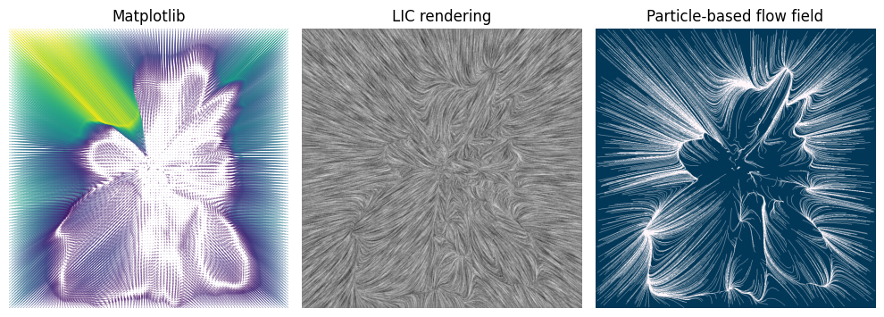

# 𖦹 vfield

A simple library to plot vector fields using particle-based flow fields.

It supports the following features:

- Parametric control on number of particles, number of flow steps, and step size
- Antialiasing
- Custom color schemes
- Runs fully on GPU if available

See the demo notebooks for usage examples.
