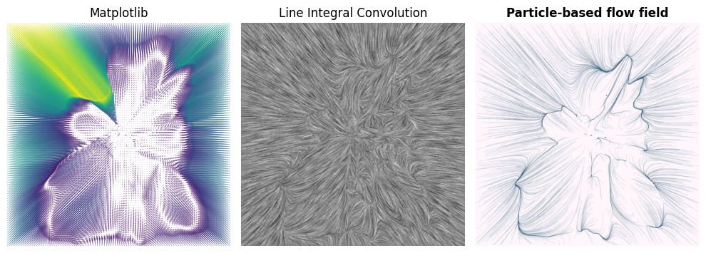

# 𖦹 vfield

A simple, minimalistic Python library for creating eye-pleasing **particle-based flow field** visualizations from vector field data.



*Figure generated with the [Teaser notebook](notebooks/teaser.ipynb).*

## Features

`vfield` makes it easy to create neat vector field renderings with:

📜 One simple script that fits ~200 lines of code, no other libraries

🎯 Full control over particle count, step count, and step size

🖌 Smooth rendering with built-in antialiasing

🎨 Custom color schemes to match your aesthetic

🚀 GPU acceleration for fast rendering on supported hardware

## Installation

```bash
git clone https://github.com/erodola/vfield.git
cd vfield
uv venv
uv pip install -e .
```

Verify with:

```bash
source .venv/bin/activate  # macOS/Linux
# OR
.venv\Scripts\activate     # Windows

python -c "import vfield; print('vfield installed successfully!')"
```

## Quick Start

```python
from vfield import render_flow_field
import torch

# Load your vector field data
vfield = torch.load('data/vectorfield.pt')
grid = vfield['grid']
displacement = vfield['displacement']

# Render flow field
image = render_flow_field(
    grid, displacement,
    W=1920, H=1080,
    particles=5000
)

image.save('output.png')
```

## Examples

See the [notebooks/](notebooks/) directory for detailed examples:
- [Demo High Resolution](notebooks/demo_hires.ipynb)
- [Parameter Exploration](notebooks/demo_params.ipynb)

## Requirements

- Python 3.11+
- PyTorch
- Matplotlib
- Pillow

## License

MIT License - see [LICENSE](LICENSE.md) file for details.
